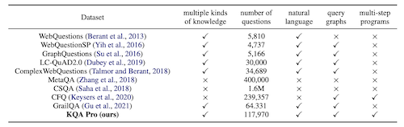

### **KQA Pro: A Dataset with Explicit Compositional Programs for Complex Question Answering over Knowledge Base.** *Shulin Cao et al.* **ACL, 2022** [(PDF)](./KQA.pdf) [(arXiv)](https://arxiv.org/abs/2007.03875) [(github)](https://github.com/shijx12/KQAPro_Baselines) (Citations 7) 
  * 问题提出：现有Complex KBQA数据集，要么没有显示的推理过程；要么规模小/不丰富。因此提出一个新的复杂KBQA数据集：KQA Pro。其由117970个不同的问题组成，涉及不同的推理技能（例如多跳、值比较、集合操作等）
  * 同时提出一种新的组合、可解释编程语言：Knowledge-oriented Programming Language (KoPL)
  * KQA Pro中的每个query都给出了对应的SPARQL和KoPL语句
  * 与其他复杂KBQA数据集的比较： 
  
  