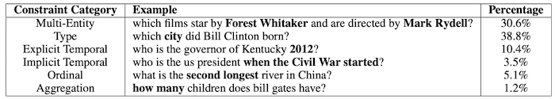
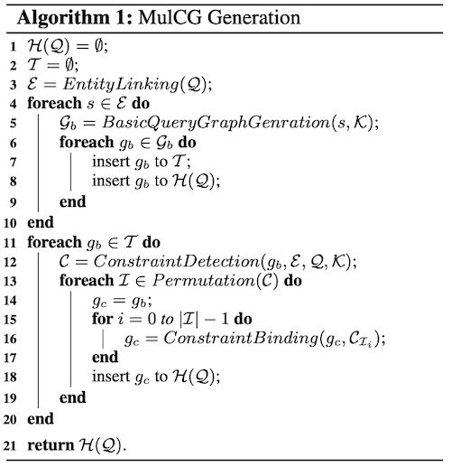
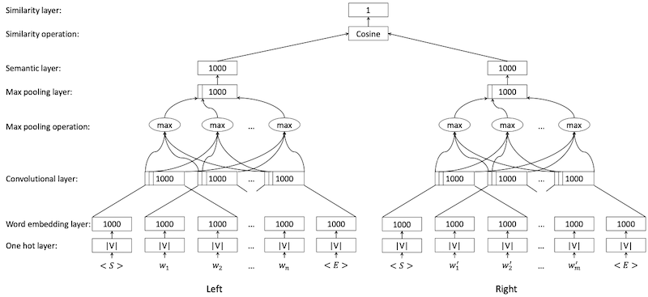
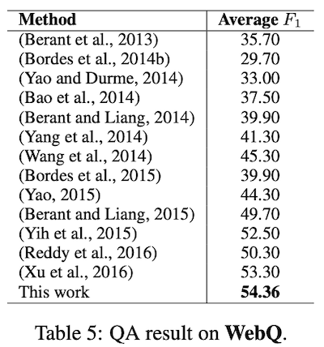

### **Constraint-Based Question Answering with Knowledge Graph.** *Junwei Bao et al.* **ACL, 2016** [(PDF)](./multicg.pdf) [(arXiv)](https://aclanthology.org/C16-1236) [(github)](https://github.com/JunweiBao/MulCQA/) (Citations 181)
  * **内容概括**
    * 提出一个新的数据集：ComplexQuestions，文章较大篇幅都在介绍数据集的数据获取、生成过程。
    * 提出一种新的查询图方法，在WebQuestions和SimpleQuestions和ComplexQuestions上取得较好效果
  * **技术细节**
    * WebQuestions中85%是简单问题或单约束问题，没办法衡量KBQA在多约束问题（‘multi-constraint’ questions）上的效果，因此作者提出一个复杂问题数据集，其中主要都是多约束问题。
    * 多约束问题（MulCQ）is defined as a question which requires multiple KB relations or special operations to get the answer. 作者经过分析给出了6种不同的约束类型
      * Multi-entity constraint：多实体约束
      * Type constraint：类型约束
      * Explicit temporal constraint：显示时间约束
      * Implicit temporal constraint：隐式时间约束
      * Ordinal constraint：顺序约束
      * Aggregation constraint：聚合约束，即答案要的是数量
      
    * different from stagg:
      * Entity constraints can be added beyond single KB fact, while stage graph only considers entities that connect to the CVT node of a single KB fact as constraints.
      * Non-entity constraints are defined and handled in a **systematic** way, while stage graph only considers limited non-entity constraints, i.e., type and gender.
  * **方案详情**
    * Basic Query Graph Generation
      *  ⟨s, p0, x⟩ or ⟨s, p1-ycvt-p2, x⟩
    * Constraint Detection and Binding
    * Search Space Generation 
    
    * Features and Ranking 
    
  * **效果：**
    * 在WebQuestions数据集上，F1达到54.36 
    
