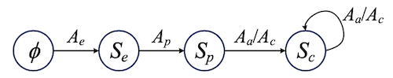
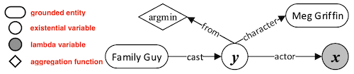
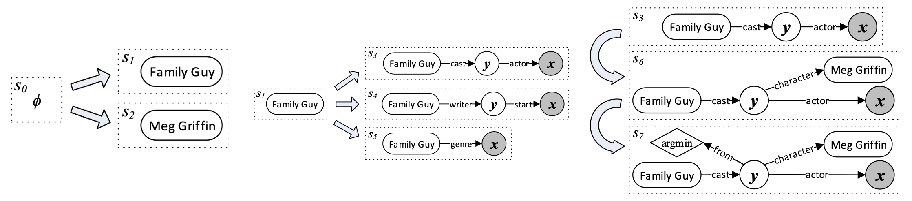

### **Semantic Parsing via Staged Query Graph Generation: Question Answering with Knowledge Base.** *Wen-tau Yih et al.* **ACL, 2015** [(PDF)](./stagg.pdf) [(arXiv)](https://aclanthology.org/P15-1128/) [(github)](https://github.com/scottyih/STAGG) (Citations 614) 
  * **内容概括**：本文提出了一种Semantic Parser解析架构
    * 其首先提出了一种可以直接转化为 Lambda 演算的查询图（Query Graph）
    * 然后定义了如何将Semantic Parser演变为Query Graph Generation的过程（4 State + 4 Action，不同State允许的Action有严格规则）
    * 最后通过 LambdaRank 算法对生成的查询图进行排序，选出最佳答案。
     
  * **什么是查询图（Query Graph）**：一种如下形式的定义，其包含4种不同功能的节点 
    * grounded entity：KG中真实存在的节点
    * existential variable：存在的中间变量
    * lambda variable：即答案变量，最终的求解答案
    * aggregation function：聚合/约束函数
    
  * **如何创建查询图（Query Graph）**
    * **entity linking** + **core inferential chain** + **constraints/aggregation nodes**
    * 示例：q=“Who first voiced Meg on Family Guy?”，查询图生成过程：
     
  * **技术细节：**
    * entity linking: 采用2015年提出的另一篇论文（S-MART）中的实体链接系统，得到候选实体和分数；
    * core inferential chain：会根据识别的实体对候选的属性进行剪枝，并采用**deep CNN + Siamese neural networks**计算Query和KG中结构化谓词的相似度；
    * constraints/aggregation：会根据预定义的一些规则和匹配尝试进行最值、实体约束挂载；
      * query中出现最大、最小等字样
      * query与答案的性别一致性校验
      * ......
    * 最后会根据图本身特征和每一步的分数特征训练一个 LambdaRank 模型，对候选图进行排序。
  * **效果：**
    * 在WebQuestions数据集上，P/R达到52.8/60.7，F1达到52.5
    
  * **评价：**
    * 此方法有效地利用了图谱信息对语义解析空间进行了裁剪，简化了语义匹配的难度，同时结合一些人工定义的处理最高级和聚合类问题的模板，具备较强理解复杂问题的能力，是 WebQuestions 数据集上强有力的 Baseline 方法。
    * 而且该方法提出的 Semantic Parser 到查询图生成转化的思想也被广泛地采纳，应用到了 Semantic Parser+NN 方法中