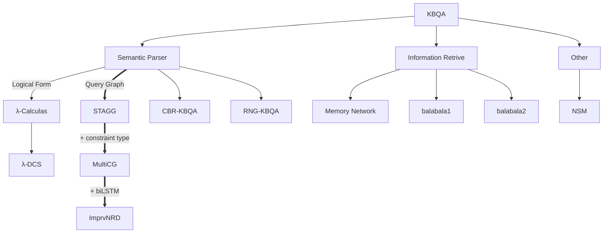

# KBQA ROADMAP
## What's KBQA?
Knowledge base question answering (KBQA) is an important task in natural language processing. It aims to answer a question over a knowledge base (KB).
## KBQA Evolutional Diagram (2013 ~ now)

## KBQA Dataset
| Name | Year | KB-based | Leaderboard | Download |
| :--: | :--: | ---- | ---- | :--: |
| WebQuestions | 2015 | Freebase | [leaderboard](https://paperswithcode.com/sota/question-answering-on-webquestions) | ---- | :--: |
| WebQuestionsSP | 2016 | Freebase | [leaderboard](https://paperswithcode.com/sota/semantic-parsing-on-webquestionssp) | [Download](https://www.microsoft.com/en-us/research/publication/the-value-of-semantic-parse-labeling-for-knowledge-base-question-answering-2/) | :--: |
| [ComplexQuestions](./SP+NN/multicg/multicg.md) | 2016 | Freebase |  | [Download]() | :--: |
| [GrailQA](./Dataset/GrailQA/GrailQA.md) | 2021 | Freebase | [leaderboard](https://dki-lab.github.io/GrailQA/) | ---- |
| [KQA](./Dataset/KQA/KQA.md) | 2022 | Wikidata | -- | [download](http://thukeg.gitee.io/kqa-pro/) |
